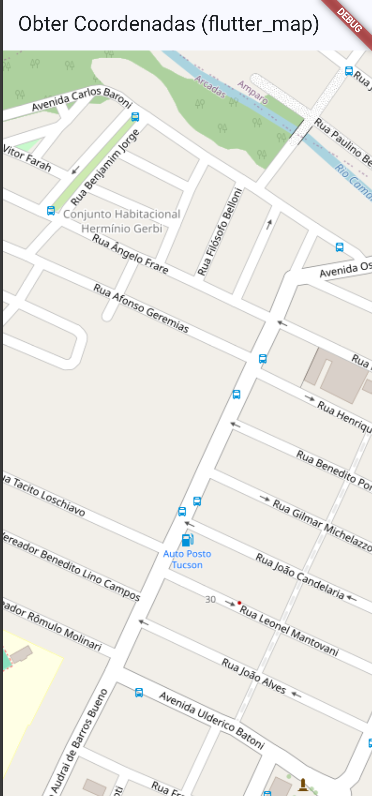

# 🗺️ Flutter Google Maps

Projeto desenvolvido em **Flutter** com o objetivo de aprender a utilizar mapas dentro de aplicativos mobile.

O aplicativo utiliza o **Google Maps** para exibir um mapa na tela, permitindo visualizar a localização e trabalhar com recursos relacionados a mapas no Flutter.

## 🚀 Tecnologias utilizadas

* Flutter
* Dart
* Google Maps
* Google Maps Flutter

## 📱 Funcionalidades

* Exibição do Google Maps
* Visualização do mapa diretamente no aplicativo
* Navegação pelo mapa
* Zoom e movimentação pelo mapa
* Integração do Google Maps com Flutter

## 📦 Dependências

A principal dependência utilizada no projeto é:

```yaml
google_maps_flutter: ^2.13.1
```

Também podem ser utilizadas outras dependências dependendo das funcionalidades adicionadas ao projeto.

## ⚙️ Como executar o projeto

### 1. Clone o repositório

```bash
git clone URL_DO_SEU_REPOSITORIO
```

### 2. Entre na pasta do projeto

```bash
cd flutter_maps
```

### 3. Instale as dependências

```bash
flutter pub get
```

### 4. Execute o projeto

```bash
flutter run
```

## 🔑 Configuração da API do Google Maps

Para utilizar o Google Maps, é necessário configurar uma **API Key** do Google Maps Platform.

A chave deve ser configurada de acordo com a plataforma utilizada, como Android, iOS ou Web.

> ⚠️ Não compartilhe sua API Key publicamente em repositórios.

## 📸 Demonstração

## 📸 Demonstração



> Coloque o print da tela do seu aplicativo na pasta do projeto e altere `print.png` para o nome exato da imagem.

## 📚 Objetivo do projeto

Este projeto foi desenvolvido como uma atividade prática para aprender como integrar serviços de mapas em aplicações Flutter e entender como trabalhar com bibliotecas externas.

## 👨‍💻 Autor

**Vinicius Godoi**

Projeto desenvolvido para estudos de **Flutter e desenvolvimento de aplicativos**.
